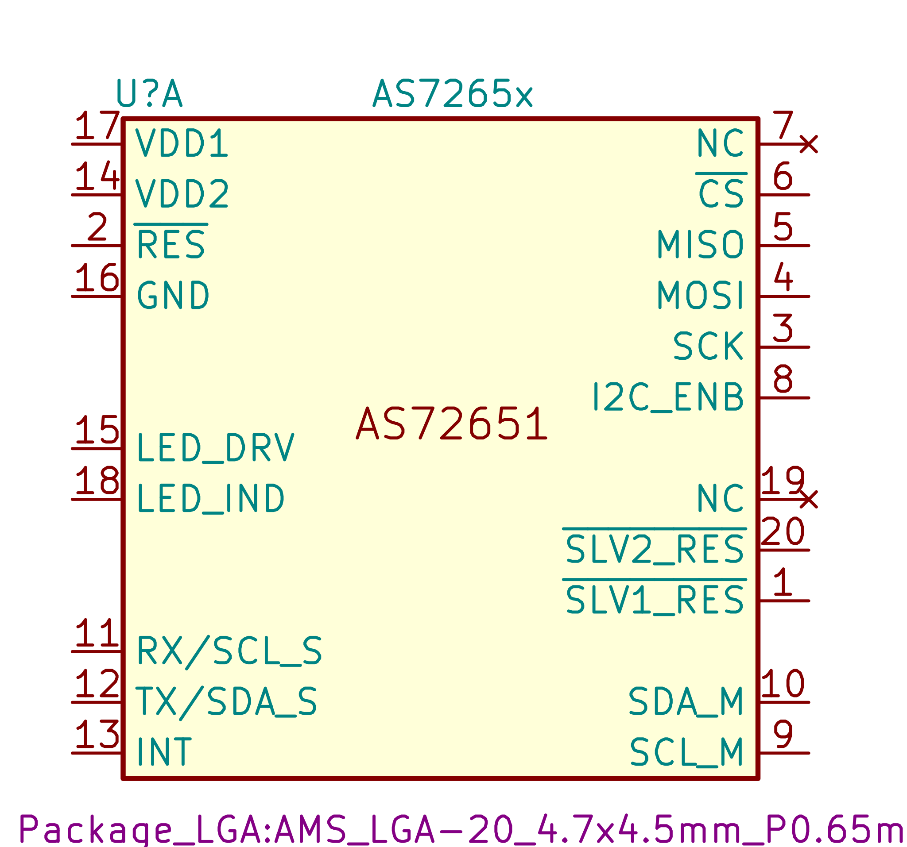
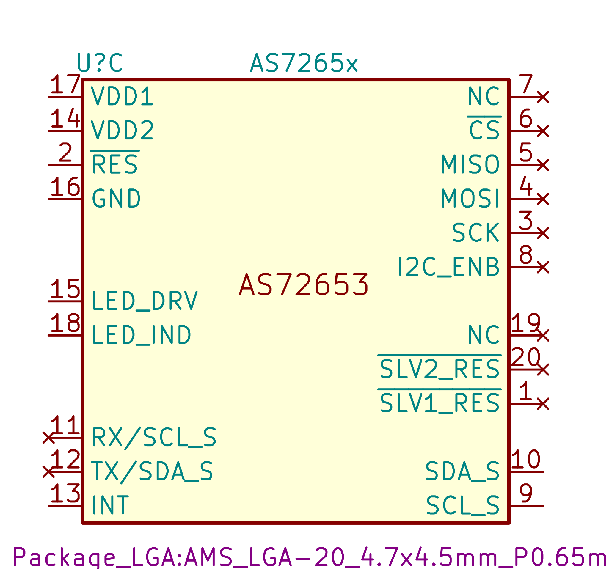

# AS7265x
KICAD LIBRARY - AS7265x Smart Spectral Sensor - Smart 18-Channel VIS+NIR Spectral_ID Sensor with Electronic Shutter

## UPDATE

* Apaprently there're some mistakes and Erratas for those chips, therefore I have confirmed with AMS and the correct pin layout has been update, this is if you're using `v12` flash firmware.

  

* From [AMS schematic](./AS7265x%20Schematic%20Generation_2.pdf)
